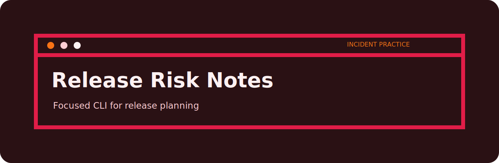
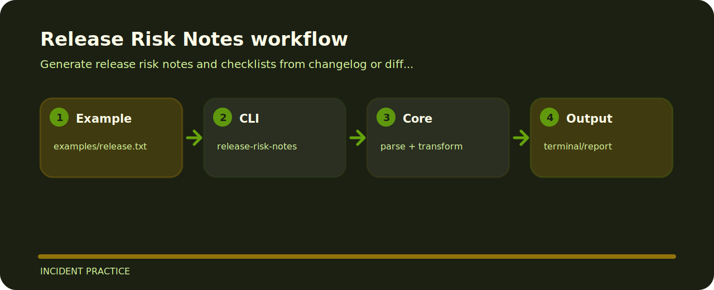

# Release Risk Notes



Generate release risk notes and checklists from changelog or diff text. The repo is kept small on purpose: clone it, run the sample, inspect the output, then adapt the idea.

## Command line

```bash
git clone https://github.com/mertefekurt/release-risk-notes.git
cd release-risk-notes
python -m pip install -e ".[dev]"
release-risk-notes examples/release.txt
```

## Repository landmarks

```text
.github/        CI workflow
examples/       sample inputs
src/            package source
tests/          test coverage
.gitignore      project file
pyproject.toml  package metadata
```

## How it runs


