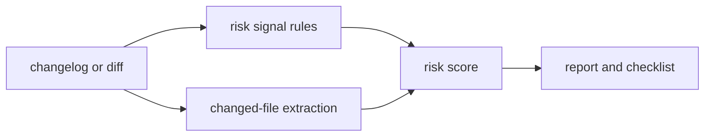

# release-risk-notes

`release-risk-notes` reads a changelog, PR summary, or saved `git diff` and generates a
short release-risk report with reviewer checklist items. It is deterministic, local, and
small enough to run in CI before a release candidate is approved.

## Why it is useful

Release notes often say what changed but not what needs extra review. This tool turns risky
signals such as migrations, auth changes, billing paths, dependency bumps, and infrastructure
edits into focused checks for humans.

## Key features

- scans changelog or diff text
- detects database, auth, billing, dependency, infrastructure, and observability risk
- extracts changed files from unified diffs
- produces Markdown or JSON reports
- exits non-zero above a chosen risk threshold
- creates a reviewer checklist from detected risk areas

## Installation

```bash
python -m pip install -e ".[dev]"
```

## Usage

```bash
release-risk-notes examples/release.txt
release-risk-notes release.diff --format json
release-risk-notes changelog.md --fail-on medium --out risk-report.md
python -m release_risk_notes --help
```

## Workflow



## Tests

```bash
ruff check .
pytest
python -m release_risk_notes --help
```

## License

MIT

